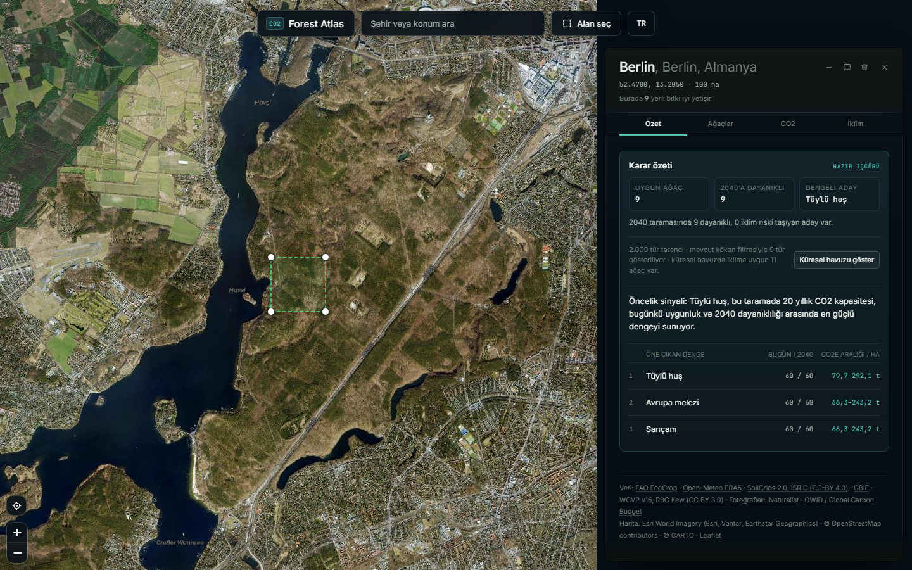

# CO2 Forest Atlas

An interactive geospatial screening tool for exploring tree-species climate
suitability, 2040 resilience and carbon context for a selected area.

CO2 Forest Atlas combines current climate observations, a single-model climate
outlook, species envelopes and historical country emissions in one map-based
workflow. It is an exploratory decision-support prototype, not a planting
prescription, carbon-credit calculator or site-level forecast.

## What It Does

- Draw or open an area anywhere on the map.
- Compare species suitability today and under a 2036-2045 climate outlook.
- Inspect native-range evidence and the main climate limitation for each tree.
- Compare 20-year CO2e sensitivity ranges by tree, hectare and selected area.
- Explore annual CO2 emissions history for 204 countries from 1950 to 2024.
- Review illustrative trend, managed-decline and net-zero pathways.

Carbon results are deliberately shown as low-to-high screening ranges. Their
current confidence is `low · class-level` because the model uses growth classes,
generic allometry and fixed stand assumptions rather than local measurements.

## Preview



## How It Works

1. Turf calculates the selected polygon's area and centroid.
2. Open-Meteo and SoilGrids provide climate, terrain and soil context.
3. The scoring engine evaluates FAO EcoCrop-style suitability envelopes.
4. The same engine compares the 2015-2024 baseline with a 2036-2045 outlook.
5. Growth and biomass models produce transparent CO2e sensitivity ranges.
6. D3 presents local and global emissions history separately from tree storage.

The detailed assumptions, range factors and status thresholds are documented in
[docs/methodology.md](docs/methodology.md).

## Run Locally

Requirements: Node.js 20 or newer.

```bash
npm install
npm run dev
```

Open `http://127.0.0.1:5173/`. The application runs locally in the browser and
does not require a backend, database, account, API key or hosted server.

## Test and Build

```bash
npm test
npm run build
```

The production files are generated in `dist/`. This repository does not include
an automatic public-web deployment workflow.

## Data and Models

- Current climate: Open-Meteo Historical Weather API, 2015-2024.
- Climate outlook: Open-Meteo Climate API, 2036-2045, `MRI_AGCM3_2_S`.
- Species envelopes: FAO EcoCrop-derived species parameters.
- Soil context: ISRIC SoilGrids.
- Native-range evidence: WCVP and digitized Little/USGS ranges where available.
- Emissions history: Our World in Data / Global Carbon Budget.
- Atmospheric CO2 context: NOAA Global Monitoring Laboratory.

See [ATTRIBUTION.md](ATTRIBUTION.md) for complete data and software notices.

## Limitations

- Future suitability currently uses one climate model.
- Carbon bands are sensitivity envelopes, not statistical confidence intervals.
- Species-level field measurements and regional allometry are not yet included.
- Results should be validated by local ecological and forestry expertise.

## Roadmap

The next priorities are regional carbon confidence, saved site passports,
comparison views, canopy/risk map modes and user-provided field evidence. See
[docs/product-roadmap.md](docs/product-roadmap.md).

## License

MIT. See [LICENSE](LICENSE). Third-party notices remain in
[ATTRIBUTION.md](ATTRIBUTION.md).
